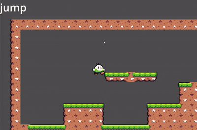

# Projeto de Software — Atividade Final (GoF, SOLID e GRASP)

## Visão Geral

Este projeto foi desenvolvido como parte da disciplina de **Projeto de Software**, com foco na aplicação integrada dos padrões de projeto **GoF (Gang of Four)**, dos princípios **SOLID** e dos padrões **GRASP**.

O objetivo da atividade é implementar um padrão GoF em um contexto original, demonstrando sua relação com boas práticas de design orientado a objetos e evidenciando sua aplicação prática em código funcional.

Neste projeto, foi utilizado o padrão **State (Comportamental)** aplicado em um jogo de plataforma desenvolvido na engine **Godot**, com uma máquina de estados responsável pelo controle do comportamento do personagem.

---

## Contexto da Aplicação

O sistema simula o comportamento de um personagem em um jogo de plataforma 2D, que pode alternar entre diferentes estados durante a execução do jogo:

* Idle (Parado)
* Walk (Andando)
* Jump (Pulando)
* Fall (Caindo)

Cada estado possui responsabilidades específicas e regras próprias de transição, permitindo a separação clara de comportamentos.

---

## Estrutura do Projeto (Godot)

O projeto foi organizado da seguinte forma:

```
Player (Cena principal)
│
├── StateMachine (Node responsável pela FSM)
│   ├── BaseState (classe base dos estados)
│   ├── IdleState
│   ├── WalkState
│   ├── JumpState
│   └── FallState
│
├── AnimatedSprite2D
├── CollisionShape2D
└── Label (debug de estado atual)
```

---

## Máquina de Estados (FSM)

A implementação segue o conceito de **Finite State Machine (FSM)**, onde apenas um estado pode estar ativo por vez.

A FSM é responsável por:

* Gerenciar o estado atual do personagem
* Controlar transições entre estados
* Delegar comportamento ao estado ativo

A mudança de estado ocorre através de eventos do jogador (input) ou regras internas do próprio estado.

---
## Demonstração do Sistema

O GIF abaixo representa o jogo em execução, evidenciando o comportamento do personagem controlado pela máquina de estados.

Durante a execução, a interface exibe o estado atual do personagem, permitindo observar claramente as transições realizadas pela máquina de estados durante a jogabilidade.



## Padrão de Projeto Utilizado (State)

O padrão **State** foi utilizado para encapsular cada comportamento do personagem em uma classe separada. Isso evita estruturas condicionais complexas e melhora a organização do código.

Cada estado implementa:

* Entrada no estado (enter)
* Saída do estado (exit)
* Processamento de input
* Atualização lógica

---

## Relação com SOLID

O projeto demonstra a aplicação dos princípios SOLID:

* **SRP**: cada estado possui uma única responsabilidade.
* **OCP**: novos estados podem ser adicionados sem modificar os existentes.
* **LSP**: todos os estados podem ser substituídos pela base sem alterar o comportamento do sistema.
* **ISP**: a interface de estado contém apenas os métodos necessários.
* **DIP**: a máquina de estados depende da abstração dos estados, não das implementações concretas.

---

## Relação com GRASP

O projeto também evidencia padrões GRASP:

* **Low Coupling**: estados são independentes entre si.
* **High Cohesion**: cada estado concentra apenas sua própria lógica.
* **Polymorphism**: comportamentos diferentes são tratados via interface comum.
* **Pure Fabrication**: a StateMachine é uma classe criada artificialmente, apenas para melhorar o design do sistema.
---

## Tecnologias Utilizadas

* Godot Engine
* GDScript
* Conceitos de orientação a objetos
* Padrão de projeto State (GoF)
* Assets GrafxKid

---

## Objetivo Acadêmico

Este trabalho foi desenvolvido com base na integração dos três pilares:

* **GoF**: padrões de projeto reutilizáveis
* **SOLID**: princípios de design limpo
* **GRASP**: distribuição de responsabilidades

Essa triangulação permite analisar o mesmo problema sob diferentes perspectivas de design, resultando em um sistema mais organizado, extensível e de fácil manutenção.
